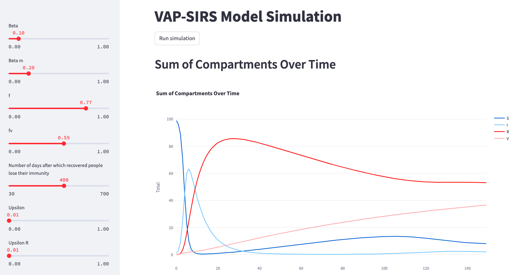
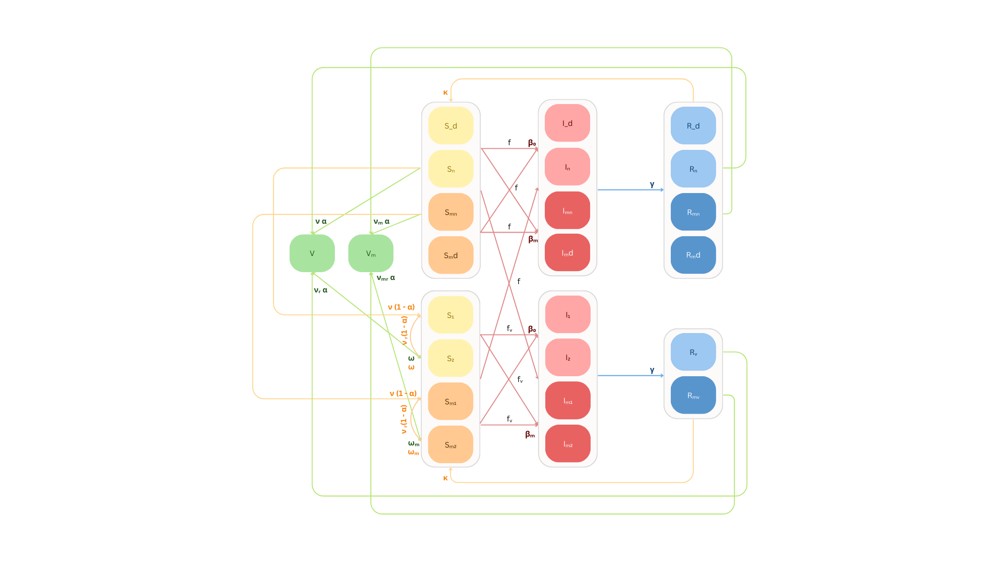
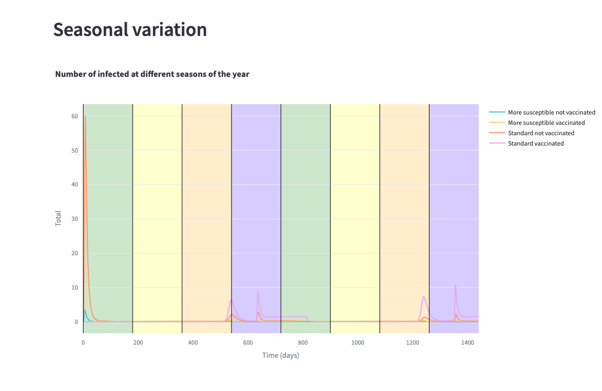

# Epidemic modelling using extended VAP-SIRS model

The project is a streamlit application that allows modeling of epidemics taking into account vaccinated and more susceptible people, with different parameter values.

Diagram of the model used. Detailed information (in Polish) is included in the file *Epidemiology_modelling.pdf*.

Running `streamlit run app.py` will launch an application that allows tracking various epidemic scenarios, including tracking seasonal variations.

